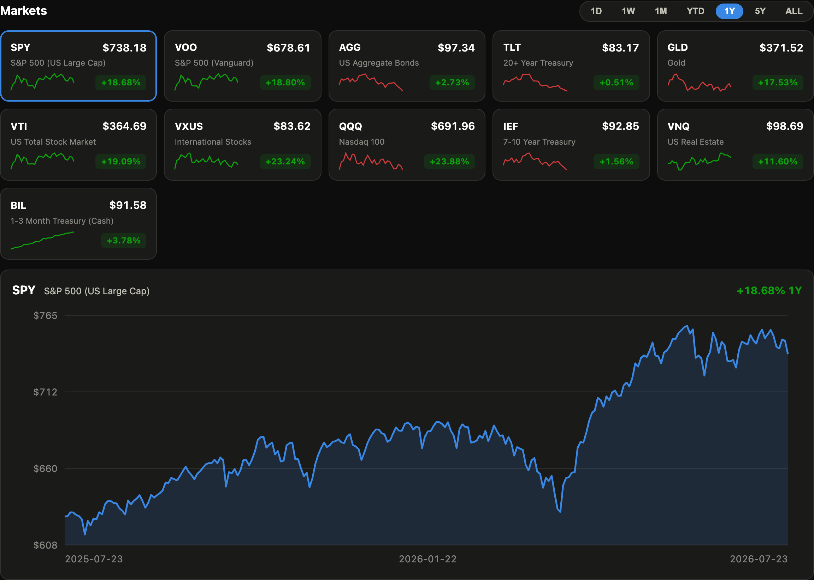
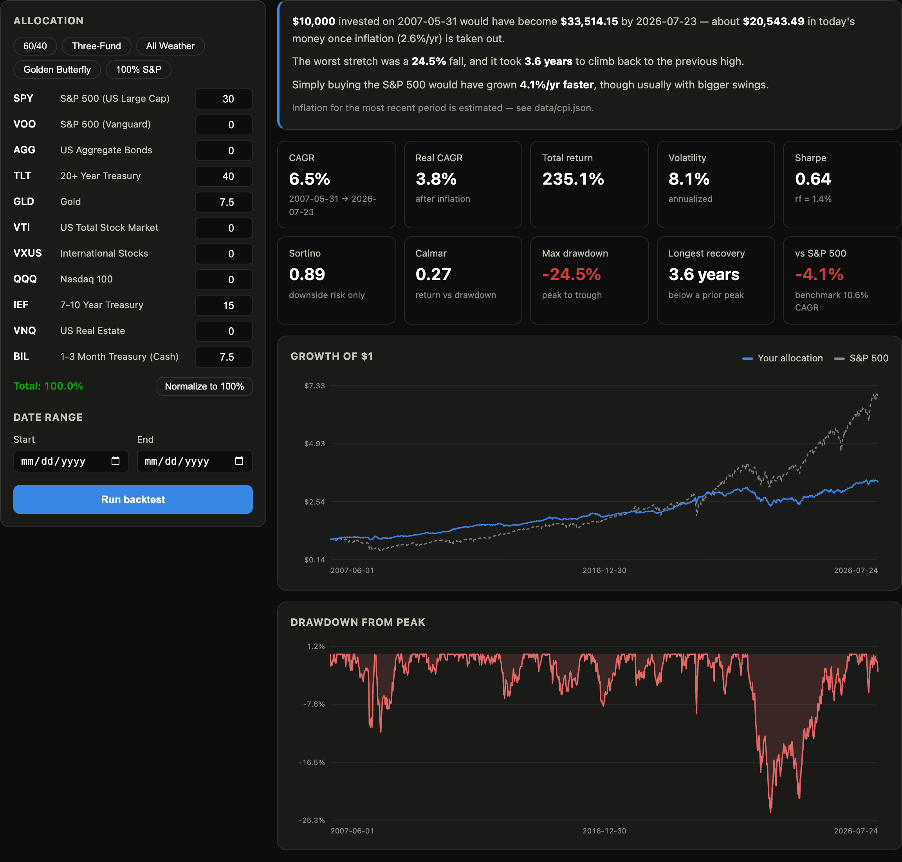
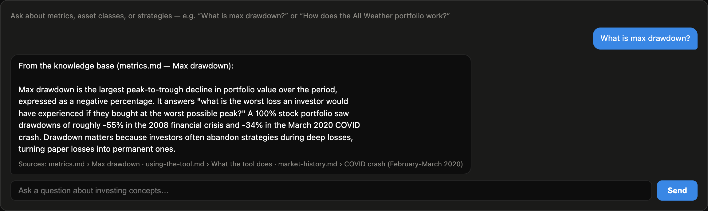
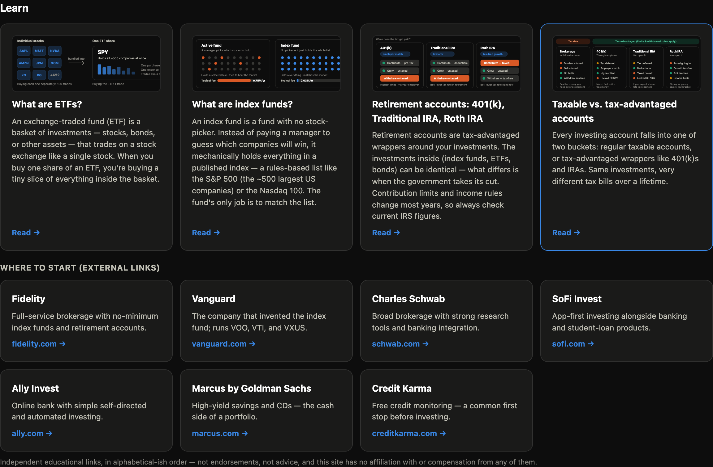

# Portfolio Decision Tool

[](https://github.com/arthurykim/portfolio-decision-tool/actions/workflows/ci.yml)
[](https://github.com/arthurykim/portfolio-decision-tool/actions/workflows/market-refresh.yml)

Track major index funds, backtest allocations against decades of real market
data, and learn the concepts as you go — in one self-contained web app.

**Educational tool only. Nothing here is investment advice.**



## Features

- **Market dashboard** — live-ish prices and returns for 11 major ETFs (SPY,
  VOO, QQQ, VTI, VXUS, AGG, IEF, TLT, GLD, VNQ, BIL) across 1D / 1W / 1M /
  YTD / 1Y / 5Y / All ranges, with sparklines and an interactive price chart.
  A GitHub Actions cron refreshes a committed market snapshot every hour
  during US trading hours.
- **Today's movers** — top 5 risers and fallers across the S&P 500 by 1-day
  change, computed live from the full catalog.
- **Stocks** — paginated, searchable S&P 500 catalog (503 constituents across
  11 pages) plus a curated recent-tech-IPO strip, all with live quotes. Sign in
  to pin stocks to a personal watchlist.
- **Stock detail** — click any symbol (table, movers, or watchlist) for a price
  chart across **1D / 1W / 1M / 6M / YTD / 1Y / 5Y / MAX**, open/high/low/volume
  stats, recent headlines linking to the publisher, and a refresh button.
  History is fetched **on demand** rather than stored — 500 symbols × 8 ranges
  would be gigabytes that go stale hourly — with a 5-minute in-process cache.
- **Learn** — original explainer articles (What are ETFs? · What are index
  funds? · Retirement accounts: 401(k)/Traditional IRA/Roth IRA · Taxable vs.
  tax-advantaged), reachable from a nav dropdown or tile grid, plus a
  "where to start" panel linking to major brokerages.
- **Accounts** — lightweight self-hosted auth: scrypt-hashed passwords,
  HMAC-signed HttpOnly session cookies, SQLite storage, zero external
  dependencies. The first registered user becomes the site admin and can edit
  the About page in place.
- **"What if I had invested…"** — hypothetical lump-sum calculator: $1,000–5,000
  into any supported fund 1–30 years ago, with the resulting growth curve,
  gain, and CAGR.
- **Backtest lab** — weight any mix of the 11 funds (presets: 60/40,
  Three-Fund, All Weather, Golden Butterfly), pick a date window, and get an
  equity curve **overlaid against the S&P 500**, a drawdown chart, and a full
  risk panel: CAGR, **real (inflation-adjusted) CAGR**, volatility, **Sharpe
  against the actual T-bill rate** (derived from BIL, not assumed zero),
  **Sortino**, **Calmar**, max drawdown, and **longest time underwater**.
  Every run is also summarized in plain English for non-finance readers.
- **Observability** — every request gets a correlation ID (`X-Request-ID`),
  structured JSON logs to stdout, Prometheus metrics at `/metrics`, and a
  `/readyz` probe that names which dependency is broken rather than returning a
  bare 503. A `llm_fallbacks_total` counter makes the chat's silent degradation
  to extractive mode visible instead of invisible.
- **RAG chat assistant** — asks-anything box over a curated finance knowledge
  base (metrics, asset classes, strategies, market history) using BM25
  retrieval. With a free `GOOGLE_API_KEY` it writes grounded answers with
  Gemini; without one it falls back to returning the best-matching passage.
  Answer quality is measured with a [RAGAS](https://docs.ragas.io) harness.

## Screenshots

**Backtest lab** — the All Weather portfolio run against the S&P 500, with the
plain-English summary, full risk panel (CAGR, real CAGR, Sharpe, Sortino,
Calmar, max drawdown, longest recovery), growth-of-$1 curve, and drawdown chart:



**RAG assistant** — a grounded answer drawn from the knowledge base, with the
retrieved source passages cited beneath it:



**Learn** — original explainer articles with custom illustrations, plus a
"where to start" panel of brokerage links:



## Architecture

```
┌─────────────────────────── one container ────────────────────────────┐
│  FastAPI (main.py)                                                   │
│  ├── /api/market         period returns for the dashboard            │
│  ├── /api/prices/:t      daily close history                         │
│  ├── /api/growth         hypothetical lump-sum calculator            │
│  ├── /api/backtest       allocation backtest (backtest.py)           │
│  ├── /api/chat           RAG assistant (rag.py + knowledge/*.md)     │
│  ├── /api/stocks/quotes  quotes for catalog symbols                  │
│  ├── /api/stocks/:s/history  on-demand OHLC by range                 │
│  ├── /api/stocks/:s/news     headlines (metadata + publisher link)   │
│  ├── /api/auth/*         register / login / logout (auth.py)         │
│  ├── /api/watchlist      per-user pinned stocks (db.py, SQLite)      │
│  ├── /api/about          editable site content (admin)               │
│  ├── /api/index-history  point-in-time S&P 500 membership            │
│  ├── /healthz /readyz    liveness + per-dependency readiness         │
│  ├── /metrics            Prometheus counters & latency histograms    │
│  └── /                   static frontend (vanilla JS, SVG charts)    │
│                                                                      │
│  data.py — yfinance download → parquet cache (hourly TTL)            │
└──────────────────────────────────────────────────────────────────────┘
```

No build step, no frontend framework, no external services: prices cache to
parquet, users and watchlists live in a single SQLite file, the UI is one
static page, and the whole thing ships as one Docker image.

## Quickstart

With [Task](https://taskfile.dev) (`brew install go-task`):

```bash
task setup     # create venv, install deps
task dev       # run at http://localhost:8000
task kill      # stop the running server
task restart   # kill + start fresh
task test      # run the test suite
```

`PORT=8001 task dev` (and `task kill`, `task restart`) to use a different port.

Without Task:

```bash
python3 -m venv .venv
.venv/bin/pip install -r requirements.txt -r requirements-dev.txt
.venv/bin/uvicorn main:app --reload   # http://localhost:8000
```

Docker:

```bash
task docker:up          # or: docker compose up --build
```

The first request downloads ~10 ticker histories from Yahoo Finance (10–20 s),
then everything is cached and auto-refreshed hourly.

### Enable the AI assistant (optional)

Copy `.env.example` to `.env` and add a free
[Gemini key](https://aistudio.google.com/apikey):

```bash
cp .env.example .env      # then set GOOGLE_API_KEY=... in .env
task dev
```

Without a key the chat still answers from the knowledge base in extractive mode.

## Testing & evaluation

```bash
task lint            # ruff over the whole repo
task test            # 128 unit + API tests; hermetic (synthetic data if no cache)
task test:integration  # 9 Milvus integration tests (needs `task vectors:up`)
task web:test        # React component tests
task check           # lint + config validation + tests, all in one
task eval:retrieval  # retrieval quality — no API key needed
task eval:chunking   # compare all 6 chunking strategies — no API key needed
task eval:modes      # compare bm25 / dense / hybrid (needs Milvus)
task eval            # RAGAS generation quality (needs GOOGLE_API_KEY)
```

### Retrieval quality

The RAG pipeline splits into a **retrieval** half (over 15 knowledge files →
110 section-level chunks) and a **generation** half (Gemini). Retrieval runs
entirely locally — including the embeddings — so its quality is measurable
offline at zero cost, scored against a 78-question golden set with the expected
source file labelled.

Three retrieval modes, selected with `RETRIEVAL_MODE`:

| mode | recall@1 | recall@3 | MRR | total misses |
|---|---|---|---|---|
| `bm25` *(default — no services required)* | 67.9% | 88.5% | 0.776 | 9 |
| `dense` (Milvus + MiniLM embeddings) | **84.6%** | 93.6% | **0.887** | 5 |
| `hybrid` (both, fused by reciprocal rank) | 79.5% | **96.2%** | 0.870 | **3** |

BM25 alone leaves **9 of 78 questions with nothing relevant in the top 3** —
paraphrases whose wording shares no tokens with the source text ("how much did I
lose at the worst point?" vs a chunk that only says "drawdown"). Adding
embeddings cuts that to **3**. Hybrid is deliberately chosen over `dense`
despite a lower recall@1, because the model receives the top 4 passages, so the
tail (recall@3) is what governs answer quality.

Dense retrieval is **optional at runtime**: if `sentence-transformers` is missing
or Milvus is not running, retrieval logs a warning and falls back to BM25 rather
than failing.

```bash
task vectors:up      # start Milvus (etcd + MinIO + Milvus, via docker compose)
task vectors:build   # chunk, embed locally, and load into Milvus
RETRIEVAL_MODE=hybrid task dev
```

Reproduce with `task eval:retrieval` and `task eval:modes`; per-question detail
is written to `eval/retrieval_results.json` and `eval/mode_results.json`.

**[docs/RETRIEVAL.md](docs/RETRIEVAL.md)** explains the pipeline in depth: the six
chunking strategies and how they compare, near-duplicate removal, the BM25
scoring formula with a worked example, the embedding and RRF fusion design, and
the known limitations — including a chunker ranking that reversed once the corpus
grew.

### Generation quality

`task eval` runs [RAGAS](https://docs.ragas.io) over the same golden set,
scoring faithfulness (is the answer grounded in the retrieved passages?),
context precision, and context recall. It needs a `GOOGLE_API_KEY` because
it uses an LLM as judge, and writes to `eval/results.json`.

> **Free-tier note:** Gemini's free tier caps requests *per day, per model*
> (as low as 20/day on the newest Flash). Each question costs ~4 calls, so the
> full 62-question run needs a paid tier or a roomier model. Score a subset
> that fits your quota with `EVAL_LIMIT=4 task eval`, and pace requests with
> `EVAL_RPM`.

## Deployment

One container, any host. Scripted path for **AWS App Runner** and a documented
alternative for **Azure Container Apps** — see [deploy/DEPLOY.md](deploy/DEPLOY.md).

```bash
task deploy:aws       # ECR push + App Runner create/redeploy
```

## Data & methodology

- Prices are Yahoo Finance adjusted daily closes (dividends included via
  adjustment), delayed ~15 minutes.
- Backtests assume daily rebalancing and no fees, taxes, or slippage. Daily
  rebalancing slightly overstates the rebalancing bonus versus the monthly or
  quarterly cadence most investors actually use.
- Sharpe and Sortino subtract a real risk-free rate derived from BIL (1–3 month
  T-bills) over the same window, not an assumed 0%. Windows that predate BIL's
  2007 inception fall back to 0%.
- Real returns use BLS CPI-U annual averages (`data/cpi.json`). Values are
  verified through the year recorded in that file; later periods are estimated,
  and the UI labels results as such.
- Windows clip to the overlapping history of the selected tickers (e.g. VXUS
  data starts in 2011).
- **Survivorship bias — measured, not just disclaimed.** A current-constituents
  list hides every company that failed out of the index. `scripts/build_index_history.py`
  replays 406 dated S&P 500 additions/removals (Wikipedia, back to 1976) backward
  from today's membership to reconstruct **point-in-time** constituents, exposed at
  `GET /api/index-history?as_of=YYYY-MM-DD`. The result quantifies the bias:
  **211 of the 506 companies in the January 2010 index (41.7%) are gone today** —
  including Lehman Brothers, Sears, and Twitter. Backtests themselves use ETFs,
  whose historical prices already reflect their holdings at the time, so they are
  unaffected; this matters for any future stock-level analysis.
- `data/market_snapshot.json` is refreshed hourly by CI and doubles as a
  public, versioned record of the dashboard numbers.

## Repo map

| Path | What it is |
|---|---|
Most folders have their own README with the detail; this table is the index.

**Application code** (all at the repo root today — see the note below the table)

| Path | What it is |
|---|---|
| `main.py` | FastAPI app: API routes + static serving |
| `data.py` | Price download, parquet cache, period returns |
| `backtest.py` | Backtest engine and metrics |
| `rag.py` | Chunking, dedup, BM25/dense/hybrid retrieval + optional Gemini generation |
| `embeddings.py` | Local sentence-transformer embeddings (no API key) |
| `vectorstore.py` | Milvus dense index, degrades to BM25 when unavailable |
| `db.py` / `auth.py` | SQLite persistence + stdlib session auth |
| `observability.py` | JSON logging, request IDs, metrics (stdlib only) |
| `env.py` | Loads `.env` into `os.environ` before any module reads it |

**Content, frontends, and supporting code**

| Path | What it is |
|---|---|
| `knowledge/` | Finance knowledge base + Learn articles (15 markdown files) — [README](knowledge/README.md) |
| `static/` | The **deployed** frontend (HTML/CSS/JS, no framework), served by `main.py` |
| `frontend/` | React + TypeScript + Vite client, deploys separately to Vercel — [README](frontend/README.md) |
| `tests/` | 128 hermetic tests + 9 Milvus integration tests — [README](tests/README.md) |
| `eval/` | 78-question golden set + retrieval, chunking, and mode benchmarks — [README](eval/README.md) |
| `scripts/` | Maintenance jobs: market refresh, vector build, index history — [README](scripts/README.md) |
| `deploy/` | App Runner script + deployment docs |
| `docs/RETRIEVAL.md` | How the RAG retrieval pipeline works |

**Configuration**

| Path | What it is |
|---|---|
| `Taskfile.yml` | Every developer command (`task --list` to see them all) |
| `ruff.toml` | Lint rules; `task lint` locally, enforced by the `lint` CI job |
| `pytest.ini` | Registers the `integration` marker and deselects it by default |
| `.github/workflows/ci.yml` | Lint, tests, frontend, and a container boot check — every PR |
| `.github/workflows/integration.yml` | Milvus integration suite — every PR, plus nightly |
| `.github/workflows/market-refresh.yml` | Hourly market snapshot commit (cron) |
| `Dockerfile` / `docker-compose.yml` | Single-container build; Milvus behind the `vectors` profile |

### Two frontends — read this before you start

The repo contains two separate frontends, and it matters which one you touch:

- **`static/`** is the one that is **actually deployed**. The Dockerfile copies it
  (`COPY static/ static/`) and FastAPI serves it, so it is what users get today.
- **`frontend/`** is a React rewrite that deploys separately to Vercel. It has the
  component tests and is where the project is heading.

They currently overlap in what they render. Until that is resolved, treat
`static/` as production and `frontend/` as the direction of travel — and when you
change user-facing behaviour, be explicit about which surface you meant.

### A note on the flat root

The ten application modules above sit at the repo root rather than in a package.
That is a known rough edge, not a convention worth copying — it is why the
Dockerfile shipped a hand-maintained file list that silently went stale. A
reorganization into a package is proposed separately; until it lands, new modules
go at the root next to their neighbours so the layout stays internally consistent.
